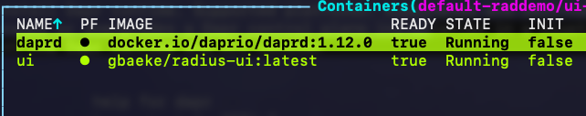

# Radius Step 1

Ran `rad init` in the root of the project. This creates the following:

- `.rad` folder: contains `rad.yaml`
- `app.bicep`: Bicep code to define and deploy the app

`rad.yaml` contains the following:

```yaml
workspace:
  application: "raddemo"
```

`app.bicep` contains the following (note that the image is already changed below; original file will have another image):

```bicep
import radius as radius
param application string

resource demo 'Applications.Core/containers@2023-10-01-preview' = {
  name: 'demo'
  properties: {
    application: application
    container: {
      image: 'gbaeke/radius-ui:latest'
      ports: {
        web: {
          containerPort: 3000
        }
      }
    }
  }
}
```

## Deploying the UI

We will modify the `app.bicep` file to deploy the UI:

- change the image in the `image` property to `gbaeke/radius-ui:latest`
- first build the UI image for the amd64 architecture; run this from the ui folder `docker buildx build --platform linux/amd64 -t gbaeke/radius-ui .`
- push the image to Docker Hub: `docker push gbaeke/radius-ui`
- enable Dapr: see https://docs.radapp.io/tutorials/dapr/

This results in this file:

```bicep
import radius as radius

@description('Specifies the environment for resources.')
param environment string

resource app 'Applications.Core/applications@2023-10-01-preview' = {
  name: 'raddemo'
  properties: {
    environment: environment
  }
}

resource ui 'Applications.Core/containers@2023-10-01-preview' = {
  name: 'ui'
  properties: {
    application: app.id
    container: {
      image: 'gbaeke/radius-ui:latest'
      ports: {
        web: {
          containerPort: 8001
        }
      }
    }
    extensions: [
      {
        kind: 'daprSidecar'
        appId: 'ui'
        appPort: 8001
      }
    ]
  }
}
```

Notes:
- `rad run app.bicep` will deploy the app to the cluster
- environment seems to be required and will automatically be set by rad run
- deployment is to namespaxe `default-demoapp`
- one pod is deployed
- if Dapr is not installed on your cluster, there will not be an error but the pod has no sidecar
    - ensure Dapr is installed with `dapr init -k`
    - delete the pod and see if it is recreated with the sidecar



- After running `rad run app.bicep`, the UI is available at http://localhost:8001; Radius automatically forwards the port to your local machine; the application is not available via an Ingress
    - when you click the Submit button, there should be an error that Dapr invoke to the API does not succeed; that's because the API is not deployed yet

## Deploying the API

- build the API image for amd64: `docker buildx build --platform linux/amd64 -t gbaeke/radius-api .`
- push the image to Docker Hub: `docker push gbaeke/radius-api`
- add a container resource to `app.bicep` and use the radius API image
- add Dapr

The resulting `app.bicep` file:

```bicep
import radius as radius

@description('Specifies the environment for resources.')
param environment string

resource app 'Applications.Core/applications@2023-10-01-preview' = {
  name: 'raddemo'
  properties: {
    environment: environment
  }
}

resource ui 'Applications.Core/containers@2023-10-01-preview' = {
  name: 'ui'
  properties: {
    application: app.id
    container: {
      image: 'gbaeke/radius-ui:latest'
      ports: {
        web: {
          containerPort: 8001
        }
      }
      env: {
        DAPR_APP: api.name  // api name is the same as the Dapr app id here
      }
    }
    extensions: [
      {
        kind: 'daprSidecar'
        appId: 'ui'
      }
    ]
  }
}

resource api 'Applications.Core/containers@2023-10-01-preview' = {
  name: 'api'
  properties: {
    application: app.id
    container: {
      image: 'gbaeke/radius-api:latest'
      ports: {
        web: {
          containerPort: 8000
        }
      }
    }
    extensions: [
      {
        kind: 'daprSidecar'
        appId: 'api'
        appPort: 8000
      }
    ]
  }
}
```

Notes:
- `rad run app.bicep` will deploy the app to the cluster
- the api will be deployed first because the ui references the name of the api (api.name)
- the ui now has an environment variable `DAPR_APP` that needs to have the Dapr app id of the api (which is api; here the same as the name of the container)
- in the ui, Dapr does not need the appPort because no calls are made via Dapr to the ui
- in Kubernetes you now have two pods, one for the ui and one for the api

## Adding redis

The ui asks to enter a question and the api generates an answer (fake). The api tries to store the question and answer in redis. When that does not succeed (e.g., when Redis is not found), the api log this as follows:

```text
api-5bfbccd9c8-mncpp api ERROR:root:Failed to store result for question Hello in Redis: Error 111 connecting to localhost:6379. Connection refused.
```

The api expects the following environment variables to be set:
- REDIS_HOST: the host name of the redis server; default is localhost
- REDIS_PORT: the port of the redis server; default is 6379
- REDIS_DB: the database number to use; default is 0

If you have Dapr installed on your develop machine, these defaults should work because Dapr installs Redis on your machine. If you do not have Dapr installed, you can use the following command to run Redis in a container:

```bash
docker run -d --name redis -p 6379:6379 redis
```

We want Redis to be available in our Kubernetes cluster. Let's do this via a Redis recipe. The following resource would do this:

```bicep
resource redis 'Applications.Datastores/redisCaches@2023-10-01-preview' = {
  name: 'redis'
  properties: {
    application: application
    environment: environment
  }
}
```

In the api, add a connection:
    
```bicep
resource api 'Applications.Core/containers@2023-10-01-preview' = {
  name: 'api'
  properties: {
    application: app.id
    container: {
      image: 'gbaeke/radius-api:latest'
      ports: {
        web: {
          containerPort: 8000
        }
      }
    }
    extensions: [
      {
        kind: 'daprSidecar'
        appId: 'api'
        appPort: 8000
      }
    ]
    connections: {
      redis: {
        source: redis.id  // this creates environment variables in the container
      }
    }
  }
}
```

In the api container, the following environment variables are now available:

- CONNECTION_REDIS_HOST=redis-hjo6ha3uqagio.default-raddemo.svc.cluster.local
- CONNECTION_REDIS_PORT=6379

We do not have to update our application because we can set the environment variables the api expects in the api definition?. Just add this block to the container definition:

```bicep
env: {
    REDIS_HOST: redis.properties.host
    REDIS_PORT: string(redis.properties.port)
}
```

When you now run the app, the logs of the api should show that the question and answer are stored in Redis:

```text
api-c8686c8ff-fj27q api INFO:root:Stored result for question xyz in Redis
```

Note: Radius forwards all the logs from the containers. You should also see the logs from redis-monitor in the ui stating that a "SET" command was executed.

## Adding a gateway

We now want to make the app available from the outside. To do this, we can add a gateway. The following resource would do this:

```bicep
resource gateway 'Applications.Core/gateways@2023-10-01-preview' = {
  name: 'gateway'
  properties: {
    application: application
    routes: [
      {
        path: '/'
        destination: 'http://ui:8001'
      }
    ]
  }
}
```

When you run `rad app run`, the gateway address will be shown in the output. Something like this: http://gateway.raddemo.4.175.112.144.nip.io.

## Running rad deploy

If you want to just deploy the app and not run it with port forwarding, you can just run `rad deploy app.bicep`. The output will be something like:

```text
Building app.bicep...
Deploying template 'app.bicep' for application 'raddemo' and environment 'default' from workspace 'default'...

Deployment In Progress... 

Completed            redis           Applications.Datastores/redisCaches
Completed            raddemo         Applications.Core/applications
Completed            gateway         Applications.Core/gateways
Completed            api             Applications.Core/containers
..                   ui              Applications.Core/containers

Deployment Complete

Resources:
    raddemo         Applications.Core/applications
    api             Applications.Core/containers
    ui              Applications.Core/containers
    gateway         Applications.Core/gateways
    redis           Applications.Datastores/redisCaches

Public Endpoints:
    gateway         Applications.Core/gateways http://gateway.raddemo.4.175.112.144.nip.io
```

## Other useful commands

- rad app list
- rad app delete APPNAME
- rad app status APPNAME: would show the amount of resources + gateway address if configured
- rad app connections: shows connections like api -> redis but also resources; also shows redis -> api
- rad env list: shows environments (if you simply ran rad init, you will have a default environment)
- rad recipe list: shows available recipes (we used redis but you also have mongo, sql, etc.)

    


